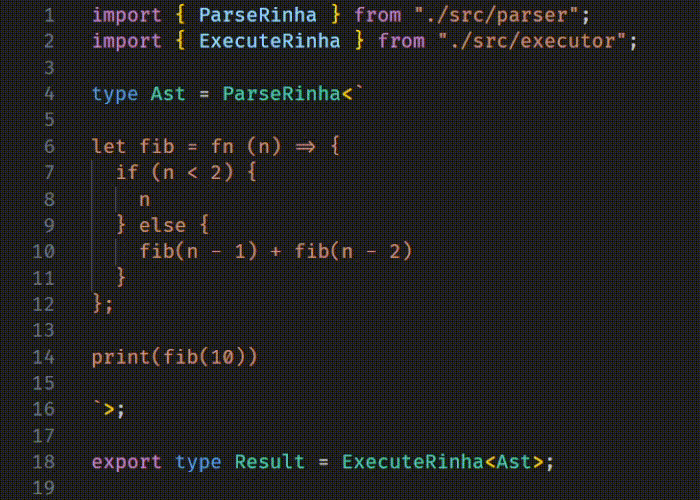

# Rinha de compiler em TypeScript (usando apenas tipos! zero código)

Implementação do desafio [rinha-de-compiler](https://github.com/aripiprazole/rinha-de-compiler/). Este repositório contém um parser da linhagem Rinha e um interpretador, ambos utilizando apenas tipos do TypeScript, explorando bastante tipos condicionais, tipos literais, e manipulação de strings em tipos.

Sim, não tem nenhum código real aqui, apenas tipos. O TypeScript é Turing completo, então é possível fazer qualquer coisa que você faria com código normal, mas apenas com tipos. Isso é possível porque o TypeScript possui um sistema de tipos bastante poderoso, que permite criar tipos que podem ser manipulados e combinados de diversas formas.

Infelizmente o TypeScript possui um limite de recursão de tipos que limita bastante processamentos como esse. Isso não é configurável. Por conta disso estamos aplicando um pequeno patch no TypeScript para remover esse limite. Veja essa issue para mais detalhes: https://github.com/microsoft/TypeScript/pull/44997.

Como um bônus, o TypeScript já provê para a gente memoization das chamadas de funções puras, então mesmo um `fib(100)` funciona rapidamente, em tempo linear.

## Como executar

Você pode abrir esse projeto no VSCode, instalar pacotes com `npm ci` e abrir o arquivo `example.ts`. Ali você pode alterar o código e ver o resultado.

Outra opção é criar um arquivo .rinha e então executar `node src/run.mjs examples/print.rinha`. Tudo o que esse comando faz é invocar o type checker do TypeScript para extrair e exibir na tela o tipo gerado.

Por fim, pode também utilizar o Dockerfile com `docker build -t rinha .` seguido por `docker run -it --rm -v $(pwd)/examples/print.rinha:/var/rinha/source.rinha rinha`.

## Como foi feito?

O código é dividido em 3 partes principais:

- `src/parser_utils.ts`: Veio de um projeto pessoal meu, em que construí utilitários para definir um parser utilizando apenas tipos em sintaxe similar a PEG, como se fosse um gerador de parser.
- `src/parser.ts`: Utiliza os utilitários do `parser_utils.ts` para definir o parser da linguagem Rinha. O output é um tipo literal que segue exatamente o mesmo formato do JSON da AST da Rinha. Exceto que o campo "location".
- `src/executor.ts`: Excuta o tipo literal da AST utilizando tree walking. O resultado é o último valor evaluado, junto com tudo o que foi escrito no console.

## Isso é útil?

Exatamente nesse exemplo, não muito, já que a linguagem é complexa demais para rodar no TypeScript não modificado. Porém com linguagens mais simples essa mesma técnica se prova útil. Por exemplo, muitas bibliotecas para criar APIs em Node.js permitem que você escreve a rota como `"/users/:userId/posts/:postId"`, você pode então parsear essa string para extrair o nome dos parâmetros e validar se estão corretos durante o type check. Sei que o Express e o Hono fazem isso. Outro caso é para parsear fragmentos de query SQL para entender o tipo de retorno. O query builder Kysely faz isso.
